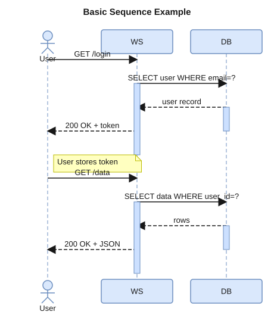
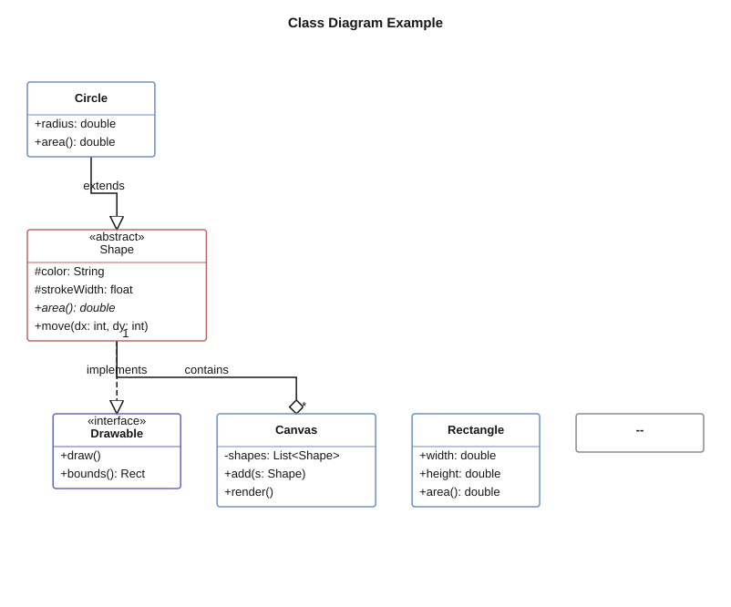
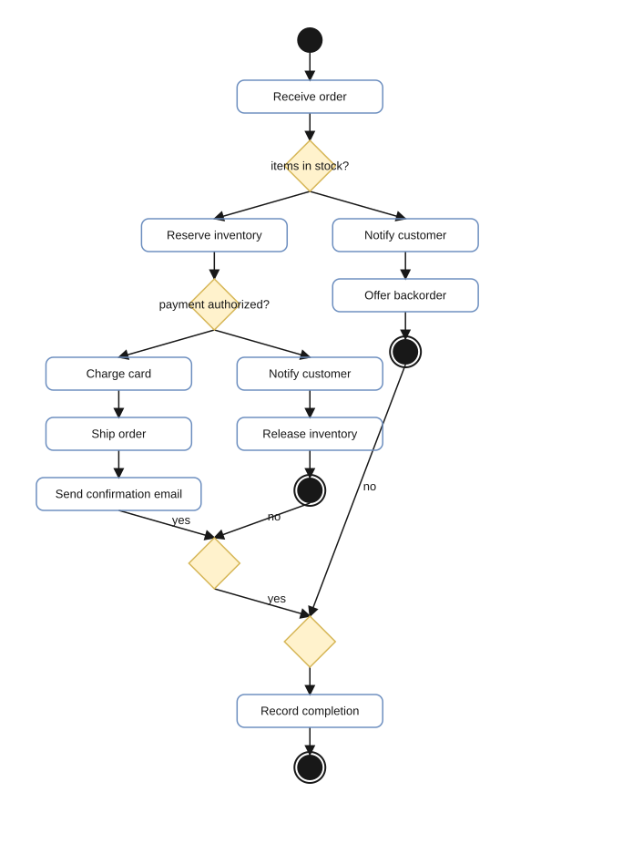
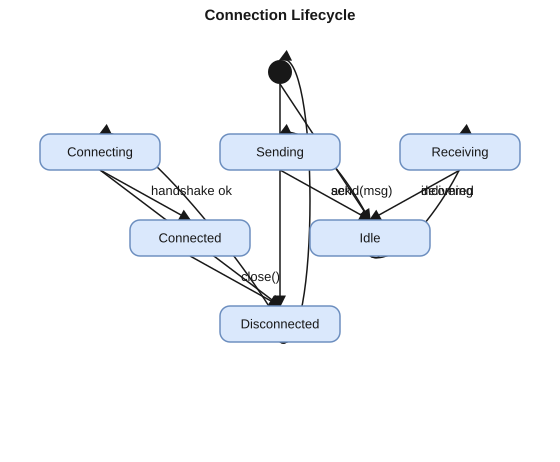
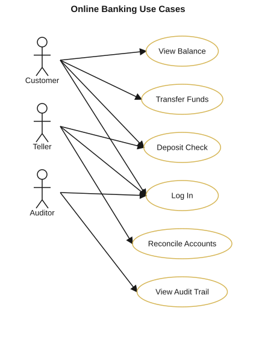
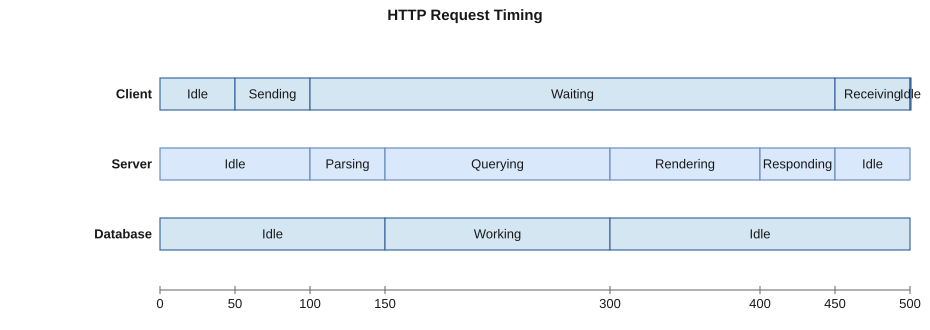
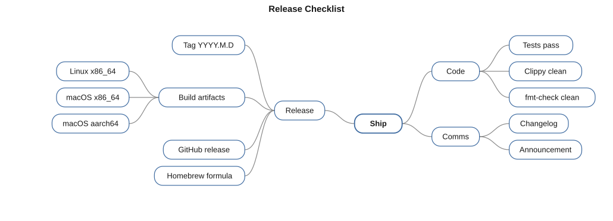
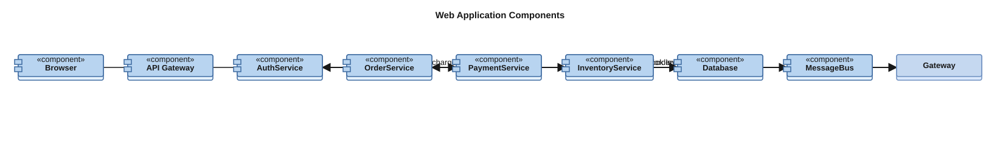
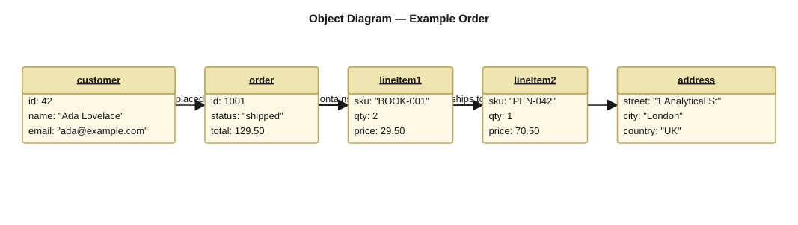
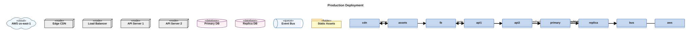

# puml

A Rust CLI reimplementation of PlantUML that renders `.puml` / `.plantuml` sources to SVG natively — no Java, no
PlantUML JAR, no runtime dependencies.

## Goals

- 100% input compatibility with PlantUML — same source files work unchanged
- Semantically equivalent SVG output (not pixel-identical)
- A single self-contained binary

## Install

### Homebrew (macOS / Linux)

```bash
brew tap grahambrooks/puml https://github.com/grahambrooks/puml
brew install puml
```

### From source

```bash
cargo install --path .
```

### Prebuilt binaries

Grab a tarball from the [latest release](https://github.com/grahambrooks/puml/releases/latest) — x86_64 Linux, x86_64
macOS, and aarch64 macOS are published on every push to `main`.

## Usage

```bash
puml examples/sequence.puml -o out.svg
```

```
puml [OPTIONS] [INPUT]

Arguments:
  [INPUT]  Input file (default: stdin)

Options:
  -o, --output <FILE>   Output SVG file (default: stdout)
  -t, --type <TYPE>     Force diagram type (sequence|class|activity|state|...)
      --theme <THEME>   Built-in theme name
  -w, --watch           Re-render on file change
  -v, --verbose         Show parse/layout debug info
  -h, --help
  -V, --version
```

Multiple diagrams in one file produce multiple output files (`out-1.svg`, `out-2.svg`, …).

## Examples

Each gallery entry below is rendered by `puml` itself from the source file linked above it. Regenerate with `make run`
or `for f in examples/*.puml; do puml "$f" -o "docs/examples/$(basename "$f" .puml).svg"; done`.

### Sequence — [examples/sequence.puml](examples/sequence.puml)



### Class — [examples/class.puml](examples/class.puml)



### Activity — [examples/activity.puml](examples/activity.puml)



### State — [examples/state.puml](examples/state.puml)



### Use Case — [examples/usecase.puml](examples/usecase.puml)



### Timing — [examples/timing.puml](examples/timing.puml)



### Mind Map — [examples/mindmap.puml](examples/mindmap.puml)



### Component — [examples/component.puml](examples/component.puml)



### Object — [examples/object.puml](examples/object.puml)



### Deployment — [examples/deployment.puml](examples/deployment.puml)



## Diagram support

| Status   | Diagram                                                             | Notes                                                                                                                                                                                                               |
|----------|---------------------------------------------------------------------|---------------------------------------------------------------------------------------------------------------------------------------------------------------------------------------------------------------------|
| Shipping | Sequence, Class, Activity, State, Use Case, Timing, Mind Map, Gantt | Full parser + layout + renderer with fixture coverage                                                                                                                                                               |
| Partial  | Component, Object, Deployment                                       | Render via the class pipeline. Missing: `[Foo]` bracket components, `attr = value` object members, PlantUML's custom shapes for node/cloud/database/folder/frame/artifact/queue (currently drawn as labelled boxes) |
| Planned  | —                                                                   | All PlantUML diagram types currently parse and render                                                                                                                                                               |

"Shipping" means: parses the common PlantUML idioms for that diagram, produces a readable SVG, has fixture + snapshot
coverage. It does **not** yet mean byte-level parity with `plantuml.jar`.

## Tech stack

- **Parser:** [`pest`](https://pest.rs/) (one PEG grammar per diagram type) with a [
  `logos`](https://github.com/maciejhirsz/logos) tokenizer pre-pass
- **SVG output:** the [`svg`](https://crates.io/crates/svg) crate (direct DOM construction)
- **Font metrics:** `rustybuzz` + `ttf-parser`
- **CLI:** `clap` v4 (derive API)
- **Testing:** [`insta`](https://insta.rs/) snapshot tests

## Architecture

```
.puml source
    └─► Preprocessor   (strip comments, resolve !include, expand !define)
        └─► Lexer      (logos tokens)
            └─► Parser (pest grammar → raw parse tree)
                └─► AST     (typed diagram nodes)
                    └─► Layout  (coordinates, sizes)
                        └─► SVG renderer (svg crate Document)
                            └─► stdout / file
```

Source layout mirrors the pipeline: `src/parser/`, `src/ast/`, `src/layout/`, `src/render/`, one module per diagram type
inside each.

## Development

```bash
make             # list available targets
make build       # fmt + clippy + cargo build
make test        # cargo test
make check       # fmt-check + clippy + test (pre-commit)
make snapshots   # update insta snapshots
make run         # render examples/sequence.puml to out.svg
```

After an intentional render change, review snapshot diffs:

```bash
cargo insta review
```

## Releases

Every push to `main` that touches source code runs the `Release` workflow, which:

1. Runs `fmt-check`, `clippy`, and `cargo test`.
2. Computes a date-based version (`YYYY.M.D`, with `-N` suffix for repeat releases on the same day).
3. Builds release tarballs for Linux x86_64, macOS x86_64, and macOS aarch64.
4. Publishes a GitHub release and updates `HomebrewFormula/puml.rb` in-place.

## Non-goals

- PNG / PDF / LaTeX output (SVG only)
- PlantUML server API compatibility
- Full preprocessor macro system (basic `!define` / `!if` only)
- Custom icon libraries
- Pixel-perfect rendering match to reference PlantUML

## License

MIT
