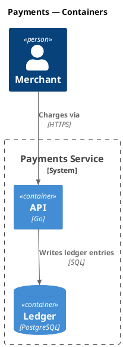

# AGENTS.md — puml diagram authoring

This project uses [`puml`](https://github.com/grahambrooks/puml), a native
PlantUML-compatible renderer (no Java, no JAR). When an AI agent (Codex,
Aider, OpenCode, Cline, …) edits or creates diagrams here, follow these
rules.

## File conventions

- Source extension: `*.puml` (preferred) or `*.plantuml`.
- One diagram per file; wrap with `@startuml` / `@enduml`.
- Names: lowercase + hyphens, intent first (`signup-sequence.puml`).

## Render commands

```bash
puml diagram.puml -o diagram.svg          # SVG (default, recommended)
puml diagram.puml -o diagram.png          # PNG, 2x scale
puml diagram.puml -o diagram.svg --watch  # re-render on save
puml diagram.puml -v                      # parse + layout debug to stderr
```

Always render after editing to verify the output is well-formed.

## Diagram type cheat sheet

| Intent                              | Diagram   |
|-------------------------------------|-----------|
| Interactions over time              | Sequence  |
| Static structure / inheritance      | Class     |
| Flowchart / branching activity      | Activity  |
| State machine                       | State     |
| User goals                          | Use Case  |
| Software architecture (C4)          | C4        |
| Infrastructure / deployment         | Deployment|

## C4 architecture diagrams



Use canonical includes: `<C4/C4_Context>`, `<C4/C4_Container>`,
`<C4/C4_Component>`, `<C4/C4_Deployment>`, `<C4/C4_Dynamic>`.

## Hard rules

- Never inline raw SVG; always author `.puml` source.
- Never edit generated `*.svg` / `*.png` artefacts by hand — rerender instead.
- Don't introduce diagram-rendering libraries other than `puml`.
- Don't use sprites, OpenIconic, or salt mockups — they're ignored.

## Soft preferences

- Stable aliases for every node, not anonymous labels.
- `title` immediately after `@startuml`.
- Declarations first, `Rel(...)` calls at the bottom.
- Parents above children in class hierarchies.
