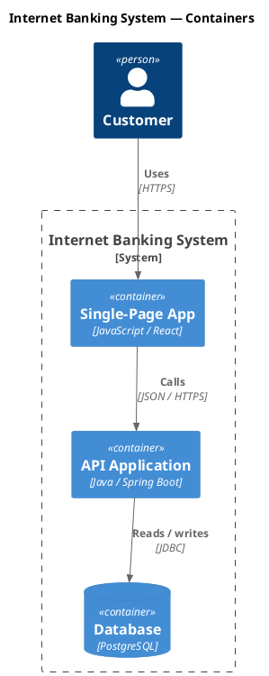

# AI Authoring Guide — puml

This project uses [`puml`](https://github.com/grahambrooks/puml), a native
PlantUML-compatible renderer that emits SVG (or PNG via `--scale`). When you
help author or edit diagrams here, follow this guide.

## Files

- Diagram sources are `*.puml` (preferred) or `*.plantuml`.
- One diagram per file unless explicitly intentional.
- Wrap content in `@startuml` / `@enduml`.
- Filenames: lowercase, hyphenated, intent-first — e.g. `signup-sequence.puml`,
  `payments-c4-container.puml`.

## Render

```bash
puml diagram.puml -o diagram.svg          # SVG (preferred)
puml diagram.puml -o diagram.png          # PNG, 2x scale
puml diagram.puml -o diagram.svg --watch  # re-render on save (Ctrl+C to stop)
```

When iterating, run `--watch` so each save re-renders and re-opens cleanly in
the previewer.

## Choose the right diagram

| Intent                                            | Diagram   | Telltale syntax                     |
|---------------------------------------------------|-----------|-------------------------------------|
| Interactions between actors over time             | Sequence  | `Alice -> Bob :`                    |
| Static structure / inheritance                    | Class     | `class`, `interface`, `<|--`        |
| Branching flow of an activity                     | Activity  | `start`, `if`, `:step;`, `stop`     |
| State machine                                     | State     | `state X`, `[*] -->`                |
| User goals                                        | Use Case  | `(Use Case)`, `:Actor:`             |
| Software architecture (C4 model)                  | C4        | `!include <C4/C4_Container>` …      |
| Deployment / infrastructure                       | Deployment| `node`, `database`, `cloud`         |

## C4 model

Use the C4 stdlib include for architecture diagrams. `puml` translates the
macros at preprocess time:



Supported includes: `<C4/C4_Context>`, `<C4/C4_Container>`,
`<C4/C4_Component>`, `<C4/C4_Deployment>`, `<C4/C4_Dynamic>`. Use the
canonical `C4_<Level>` form, not `<C4/Container>` — some preview tools reject
the short form.

For Dynamic diagrams, use `RelIndex(n, a, b, "label")` — the step number
prepends the label so the call sequence stays visible.

## Themes

Default output adapts to the viewer's light/dark preference via a CSS media
query embedded in the SVG. Override with `--theme light|dark|plain|amiga` on
the CLI, or `!theme <name>` inside the source.

## Idioms to prefer

- Give every node a stable alias (`Container(api, "API", "Spring")`), not just
  inline labels — relationships stay readable as the diagram grows.
- Place `title` immediately after `@startuml`.
- Group declarations together, keep `Rel(...)` calls at the bottom.
- For sequence diagrams, declare participants in display order at the top.
- For class diagrams, parents render above children — model that direction
  when ordering relationships.

## Idioms to avoid

- Don't mix multiple diagram types in one file.
- Don't use bitmap-only PlantUML features (sprites, OpenIconic, salt) —
  `puml` ignores them.
- Don't reach for `LAYOUT_*` / `Lay_*` hints inside C4; the layout engine
  ignores them and the diagram stays readable without them.
- Don't rely on absolute coordinates — the layout is recomputed every render.

## When something looks wrong

1. Re-render with `-v` to see the parse + layout debug output.
2. Check the `examples/` directory in the puml repo for a working version of
   the construct you're trying to use.
3. If a C4 macro isn't recognised, confirm you're using the canonical
   `<C4/C4_*>` include path.
