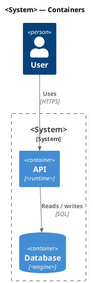

# GitHub Copilot — puml authoring instructions

This project uses [`puml`](https://github.com/grahambrooks/puml), a native
PlantUML-compatible CLI that emits SVG (and PNG via `--scale`). Follow these
rules when suggesting edits to `*.puml` / `*.plantuml` files or the diagrams
they produce.

## Conventions

- One diagram per file, wrapped in `@startuml` / `@enduml`.
- Filenames: lowercase, hyphenated, intent-first.
- Source extensions: `.puml` (preferred) or `.plantuml`.

## Rendering

```bash
puml diagram.puml -o diagram.svg          # SVG output
puml diagram.puml -o diagram.png          # PNG, 2x scale
puml diagram.puml -o diagram.svg --watch  # re-render on save
```

## Diagram selection

| Intent                          | Diagram   |
|---------------------------------|-----------|
| Interactions over time          | Sequence  |
| Static structure / inheritance  | Class     |
| Branching activity              | Activity  |
| State machine                   | State     |
| User goals                      | Use Case  |
| Software architecture (C4)      | C4        |
| Infrastructure                  | Deployment|

## C4 model



Use canonical includes: `<C4/C4_Context>`, `<C4/C4_Container>`,
`<C4/C4_Component>`, `<C4/C4_Deployment>`, `<C4/C4_Dynamic>`.

## Style

- Give every node a stable alias.
- `title` immediately after `@startuml`.
- Declarations first, `Rel(...)` calls last.
- Parents above children in class hierarchies.

## Avoid

- Multiple diagram types per file.
- Sprites, OpenIconic, salt mockups, `LAYOUT_*` hints — `puml` ignores them.
- Hand-editing generated `.svg` / `.png` files; rerender instead.
