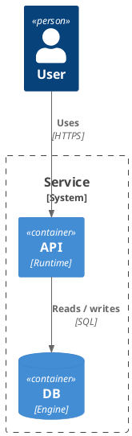

# Windsurf rules — puml diagram authoring

This project uses [`puml`](https://github.com/grahambrooks/puml), a native
PlantUML-compatible renderer. When editing `.puml` / `.plantuml` sources, or
the diagrams they produce, follow these rules.

## Files

- One diagram per file, wrapped in `@startuml` / `@enduml`.
- `.puml` is preferred over `.plantuml`.
- Filenames: lowercase, hyphenated, intent-first.

## Render

```bash
puml diagram.puml -o diagram.svg          # SVG (preferred)
puml diagram.puml -o diagram.svg --watch  # live reload
```

## Diagram selection

| Intent                          | Diagram   |
|---------------------------------|-----------|
| Interactions over time          | Sequence  |
| Static structure / inheritance  | Class     |
| Branching activity              | Activity  |
| State machine                   | State     |
| User goals                      | Use Case  |
| Software architecture (C4)      | C4        |
| Infrastructure                  | Deployment|

## C4 model

Use canonical stdlib includes: `<C4/C4_Context>`, `<C4/C4_Container>`,
`<C4/C4_Component>`, `<C4/C4_Deployment>`, `<C4/C4_Dynamic>`.



## Prefer

- Stable aliases for every node.
- `title` immediately after `@startuml`.
- Declarations first, `Rel(...)` last.
- Parents above children in class hierarchies.

## Avoid

- Multiple diagram types per file.
- Sprites, OpenIconic, salt mockups, `LAYOUT_*` hints.
- Hand-editing generated `.svg` / `.png` files — rerender instead.
